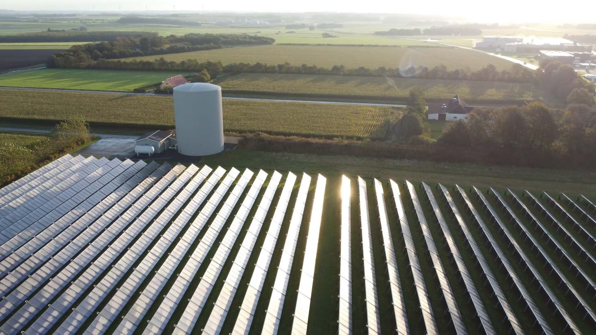

```{r setup, include=FALSE}
knitr::opts_chunk$set(echo = TRUE)


```
**Solar thermal is the walking and cycling of the energy world. Low tech, low resource and quick and cheap to build. But in many places, including the UK it has been completely overlooked. I was passing through Denmark and decided to drop in and learn about how the Danes do it.**

Back in the 1920s car manufacturers were struggling to solve 'engine knock', an annoying and often terminal engine condition. Tetraethyl Lead, or leaded petrol, is well known as the substance that solved this. But less well known is that the US chemist Thomas Midgley, credited with this invention, knew that ethyl alcohol was just as effective, but it was ignored as it couldn't be patented and thus was far less profitable. After decades of Lead's health effects being swept under the carpet and investigating scientists smeared, the danger of leaded petrol was finally recognised by governments in the 70's but it still took until well into the 90's for bans to finally come into force. The emissions from Leaded petrol are now regarded as one of the biggest public health and environmental disasters in recent history [@fullerInvisibleKillerRising2018].

In a similar way the the push for decarbonisation and the scramble to divest from Russian gas is dominated by high tech solutions, from nuclear fusion and fuel cells to batteries and green hydrogen, attracting enormous investment pots. Yet all these solutions have one thing in common, they are all focused on electricity, which only accounts for around 20% of our total energy consumption. Without a doubt electricity is becoming an increasingly significant energy medium, but like with engine knock are we missing a cheaper, simpler and far more environmentally friendly solution to our energy needs? Solar Thermal: using the suns energy to directly heat water.


In 2020 501GW of low temperature solar thermal capacity was in operation around the world. This compares with 743 GW of wind, 708GW of solar PV capacity [@weissSolarHeatWorldwide2021] and 398 GW of nuclear [@iaeaPRISTrendReports2022]. This makes solar thermal one of the largest low carbon energy technologies in the world, and far and away the largest renewable heat source.

Unlike with solar PV, where 15-20% of solar irradiation is converted to electricity via the photoelectric effect, solar thermal collectors pass water through comparatively simple collectors, made of only plastic and annealed or blown glass. These panals can be up to 80% efficient in utilising incident sunlight. The Dutch company [Resolar](https://www.resolar.nl/) estimates that whilst a solar PV system can generate 155 kWh/m$^2$ annually, a flat plate solar thermal collector can provide 495 kWh/m$^2$ and a vacuum tube system 610 kWh/m$^2$, nearly 4 times PVs energy.


Possibly one of Denmark's best kept secrets is its expanding district solar thermal district heating industry. 60% of Danish households are connected to a district heating network and 61% of that energy is supplied by solar and wind, with a target for 100% by 2030. And the technology has barely changed since the first solar district heating system was installed in Sweden in the late 70's supplying 100 houses in town of Vester Nebel[@putzIntegrationLargeScaleSolar2021]. Similarly devoid of lucrative oil fields, Denmark followed suit a few years later and has quietly embraced the technology, culminating in the opening the worlds largest plant at Sikeborg in 2017, which supplies 20% of the annual heat requirements to 21,000 houses. This took the total solar district heating capacity to 1GW, cementing it's place as the European leader in the technology. The figure below shows how the industry has taken off in the past decade, data from [@SOLVARMEDATADK].


Since hearing about the Danish systems a few years ago I had been eager to find out more. Planning a train trip to Norway last October I looked up the nearest system to a train station on my route, which happened to be Vrå, a small town just south of Hjørring in Northern Jutland. 

Chugging through the lush countryside on a diesel train, a timetable discrepancy led to a conversation with an impressively knowledgeable journalist on his weekly commute back to Aarlborg from Copenhagen to retrain in PR due to the collapse of the print news industry. To my relief he confirmed solar thermal was indeed a big deal in Denmark, explaining one of the driving factors for its popularity was local opposition to onshore wind turbines. It seemed like Denmark wasn't that disimilar to the UK.


I was met by Finn, at the main control centre of the towns district heating provider [Vrå Varmeværk](https://www.vraa-varmevaerk.dk/), a short walk from the main train station. After heading out to the site, he proudly showed me round the immaculate facility and gave the lowdown on the system, which has been operational since 1959 and now serves most of the 2,500 residents. Originally supplied by oil it gradually switched to natural gas and electricity over the decades and in 2015 13,100m$^2$ of solar thermal collectors, manufactured 30km south of the town by [Aarlborg CSP](https://www.aalborgcsp.com/), were connected on a 40,000m$^2$ piece of farmland to the north of the town.  It is now the 35th largest solar district heating system in Europe [@dalenbackRankingListEuropean]. As part of this scheme an additional 3,000m$^2$ of hot water storage was added to the 750m$^2$ tank already in the town centre. The system, including connection to the existing network, cost 6.5 million Euros and produces 6,300 MWh of heat annually, saving the town 570,000m$^3$ of natural gas imports each year. The water tanks also have electrical coils installed, with a total capacity of a 7MW to make use of 'plunge pricing' events where they can get paid to take abundant wind electricity off the grid, a common event in winter when solar generation is at it's lowest.





In the same year as the solar systems installation, an anaerobic digestion facility, Grøngas Vrå was built 2km from the town, processing livestock manure and residues from agricultural production and the food industry. Despite delays caused by legal action from the natural gas company HMN Gasnet, upset at losing custom [@nordjyskeRorLederOverskudsvarme2016], a pipe was laid along the main road to connect the facility to the town in 2017, enabling waste heat to be used and also stored in the tanks. It is estimated that both the 1km pipe connecting the solar thermal plant and the 2km pipe to the Green gas facility both have approximately 0.5°C loss thanks to the later using newer generation twin bore pipes.

Together, solar thermal, wind and the anaerobic digestion meet almost all the towns space heating and hot water needs, slashing the towns reliance on imported natural gas.

Danish DH companies fall under the "cost of service" principle which essentially means they are not for profit and price the consumer pays must reflect the cost of the energy. The DH heat companies are typically owned by consumers or the local municipality, meaning there is no pressure from shareholders eager for a short term investment return [@trierSolarDistrictHeating2018].

An annual budget is provided by Vrå Varmeværk each year setting out the cost for each household. The exorbitant cost of natural gas is still causing a price rise, an annual increase of 30kr (£2.50) per MWh has been agreed, meaning a typical 130m2 property in the town using 18.1 MWh (UK average domestic natural gas consumption is 12 MWh) will see an increase of around £50, taking the annual bill to £900, not bad in a country where the average salary is £50,000 a year.

The October morning of my visit was pleasantly sunny, the plethora of set points and readouts in the control room showed town was consuming 2.5MW of heat and the solar site was receiving 391W/m$^2$, generating 5MW. However, in mid summer the towns consumption will be around 1MW, yet the solar farm could easily be generating more than ten times that.

The disparity with heat generation and consumption is a consistent challenge with any solar thermal system, in fact a key feature of Vrås system is the ability to run it in reverse during the night to 'dump' as much as 10MWh to the air, enabling the system to continue to circulate the next day avoiding stagnation and overheating of the panels. Later this year a second 3,000m$^2$ tank will be built to take the thermal storage to over 100MWh. 

Currently the solar system manages to generate 22% of the towns heating and hot water needs, but some of the larger systems in Denmark have also installed 'interseasonal' heat stores in the ground, which increase the solar fraction dramatically, enabling more than 50% of year round district heating energy requirements to be met. [Dronninglund](https://www.solar-district-heating.eu/wp-content/uploads/2019/10/Dronninglund-evaluation-report-2015-2017_20190531.pdf) has a 60,000m$^3$ pit heat storage, achieving a 90% storage efficiency and three other sites, [Brædstrup](https://www.solar-district-heating.eu/wp-content/uploads/2019/10/Braedstrup-evaluation-report-2014-2017_2019.05.24.pdf), [Marstal](https://www.solar-district-heating.eu/wp-content/uploads/2019/10/Marstal-evaluation-report-2015-2017_2019.05.28.pdf) and [Gram](https://www.solar-district-heating.eu/wp-content/uploads/2019/10/Gram-evaluation-report-2016-2017_20190531.pdf) also have large heat stores, drastically increasing the energy that can be recovered from the abundant summer heat as well as surplus wind electricity.

Despite continental Europe's dominance of the market, probably the most famous solar district heating system is the [Drakes Landings Solar Community (DLSC)](https://www.dlsc.ca/) in Canada, which, using a borehole interseasonal heat store have met 100% of their year round space heating needs from solar energy since 2015, the majority of which is generated in summer. The University of Edinburgh developed a model to determine how the Drakes Landings concept could work at two sites, Cambourne and Aberdeen in the UK. It found that whilst the annual irradiation would be less, other conditions, such as a more moderate climate would reduce losses and the systems could also meet most of year round hot water and space heating needs [@renaldiTechnoeconomicAnalysisSolar2019]. Such systems are perfect for new developments, which like DLSC can install a thermal collectors on each house roof, alongside solar PV, negating the need for a separate field to be used. [Ecovat](https://www.ecovat.eu/ecovat/?lang=en), a Dutch company, specifically develops underground thermal storage tanks for large developments.

Low temperature thermal storage, like solar heat collectors are a low tech, low resource and environmentally benign technology that can quickly and easily be installed to unlock local energy sources that would otherwise be lost. The systems in Denmark are basically holes in the ground, lined with plastic and filled with water, or boreholes drilled into the ground. Unfortunately the cost is yet to reflect this simplicity, in large part due to the little that has been invested in it. According to IEA data on research budgets, UK energy research spending since 1974 has been dominated by nuclear fusion and fission with 13.6 billion being spent, nearly 6 times more than renewable energy, which has received a similar sum to fossil fuel R&D. Thermal energy storage has received less than 1 million equating to £21,000 a year compared with £295 million for nuclear [@ieaEnergyTechnologyRD2022].

This simplicity hides the enormous potential. A report last year estimated that the UK had 4.9 TWh (17.9PJ) waste heat potential per annum within 10km of a district heating network [@manzDecarbonisingDistrictHeating2021]. The enormous amount of summer heat generated from solar thermal systems could easily be used in industrial processes. The total global heat demand for low and medium temperature applications accounts for 44 EJ (exajoule) globally (≈12,222 TWh). The chart below shows this heat demand for selected industries.


Another issue facing 'solar farms' can be the opposition to their presence on landscapes often perceived as natural, yet they can actually have significant benefits for biodiversity compared with an intensive farming usage. Factors such as an absence of regular ploughing, reseeding and fertiliser or pesticide application can allow wildlife to flourish undisturbed, whilst the shading effect can potentially be likened to that of a woodland [@parkerBiodiversityBenefitsSolar2018]. A significant improvement in solar thermal installations in recent years has been achieved with steel profiles that are hammered into the ground, removing the need to significantly flatten the land or use concrete, improving the environmental benefits further, at the same time reducing costs and enabling systems to be installed in previously challenging locations (figure below) [@trierSolarDistrictHeating2018].

And it is not just flat plate collectors that can tap into heat. [ICAX](https://www.icax.co.uk/solar_road_systems.html) have been installing tarmac heat recovery for nearly two decades. Tarmac is one of the best thermal absorbers, so good that roads regularly deform in summer, requiring expensive and resource intensive repair. Taking the heat away could prevent this, also reducing urban heat islands in cities. The same system can be used to supply heat in winter, negating the need for gritting and reducing damage from ice freeze thaw.

Tackling heat demand is crucial to reducing energy costs, CO~2~ and pollutant emissions and improving energy security. There is an abundance of heat sources in our towns and cities. These low tech systems might not be as exciting as hydrogen fuel cells or nuclear fusion, but maybe instead of throwing billions hope of being able to replicate the sun in 50 years time, we look under our noses at a home grown, safe, cheap and low resource technology that is ready to be rolled out right now.


## Useful Links:
 * IEA solar heating and cooling prgramme  https://www.iea-shc.org/  
 * data from solar district heating plants https://solvarmedata.dk/  
 - good reference site for information on solar thermal and district heating https://www.solar-district-heating.eu/dk-monitoring-2/  
- district heating school https://fjernvarmeskolen.dk/  
- current projects in Europe https://www.solar-district-heating.eu/de/solites-current-projects/  
- Danish district heating association https://www.danskfjernvarme.dk/aktuelt  
- economics of heat storage https://solarthermalworld.org/news/seasonal-pit-heat-storage-cost-benchmark-30-eurm3/  
- integrating renewables into district heating https://irena.org/publications/2021/March/Integrating-low-temperature-renewables-in-district-energy-systems  
- solar heat for industrial processes https://www.solar-payback.com/wp-content/uploads/2017/07/Solar-Heat-for-Industry-Solar-Payback-April-2017.pdf  
- guidelines for policymakers https://vbn.aau.dk/ws/portalfiles/portal/406326231/Integrating_low_temperature_renewables_in_district_energy_systems_Guidelines_for_policymakers_2021.pdf  

## References
